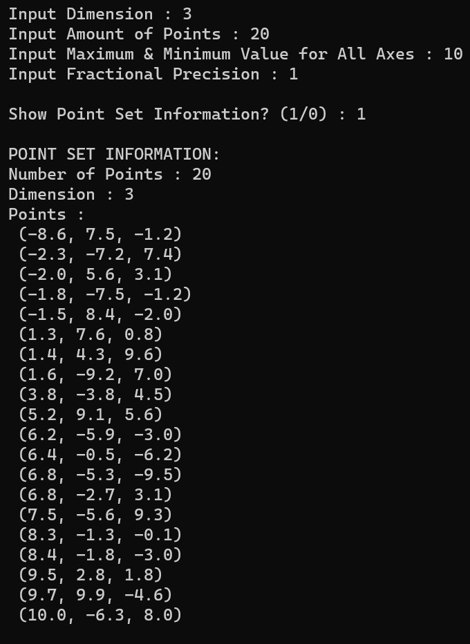
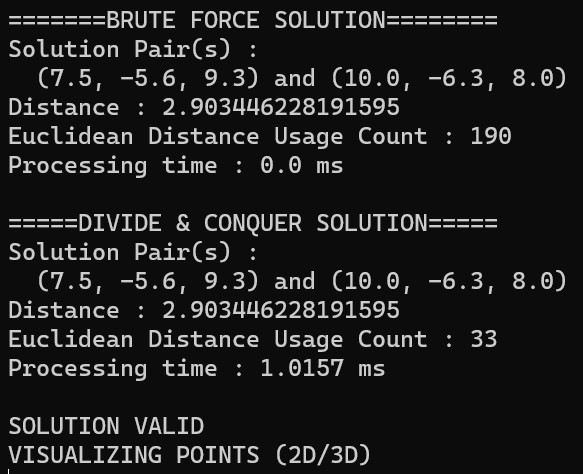
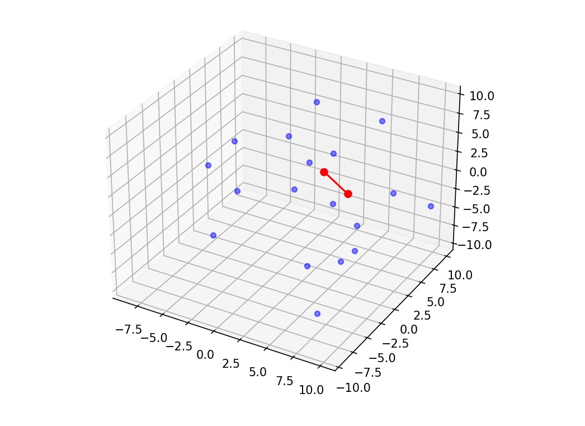

# Mencari Pasangan Titik Terdekat 3D dengan Algoritma Divide and Conquer
## Tugas Kecil 2 - Strategi Algoritma 2022/2023
Tugas Kecil Mata Kuliah IF2211 Strategi Algoritma 2023 - Closest Pair

## **Table of Contents**
* [General Information](#general-information)
* [Requirements](#requirements)
* [How to Run and Compile](#how-to-run-and-compile)
* [Screenshot](#screenshot)
* [Program Structure](#program-structure)
* [Author](#author)

## **General Information**
>The closest pair of points problem is a classic problem in computational geometry and computer science. The problem is to find the pair of points in a set of points that are closest to each other. Given a set of n points in a d-dimensional plane, the problem is to find the pair of points with the smallest Euclidean distance between them.


In this repository, the solution for the closest pair problem is implemented using the *divide and counquer* algorithm.

## **Requirements**
To use this program, you will need to install **Python3** (https://www.python.org/downloads/) on the device you are using. You will also need **matplotlib** to be installed before running the program.
* Matplotlib Library
  ```sh
  pip install matplotlib
  ```
## **How to Run and Compile (Windows)**
### **Setup**
1. Clone this repository <br>
```sh 
$ git clone https://github.com/yuujin-Q/Tucil2_13521074_13521100.git
```
2. Open this repository in terminal
### **Compile (optional)**

1. Install pyinstaller <br>
```sh
$ pip install pyinstaller
```
2. Open terminal in root directory, navigate to 'src' directory. <br>
```sh
$ cd src
```
3. Run the following command. The compiled binary executable will be located in the 'bin' folder <br>
```sh
$ pyinstaller --onefile ./src/main.py --distpath=./bin
```
4. Alternatively, execute 'build.bat' from root directory of repository
```sh
$ ./build.bat
```
### **Run**
1. Change the directory to the 'bin' folder <br>
```sh 
$ cd bin
```

2. Run the program (or open file *main.exe* from file explorer)<br>
```sh 
$ ./main.exe
```

3. Alternatively, run the program directly using 'python' <br>
```sh
$ python src/main.py
```
4. Alternatively, execute 'run.bat' from root directory of repository <br>
```sh
$ ./run.bat
```


## **Screenshot**

 
 
 


## **Program Structure**
```
.
│   .gitignore
│   README.md
|
├───bin
|   └───main.exe
|
├───doc
|   └───Tucil1_13521074_13521100.pdf
|
└───src
     |
     └───main.py
         point_set.py
         solver.py
         visualizer.py

```

## **Authors**

| **NIM**  |       **Name**        | **Class**  |       
| :------: | :-------------------: | :------:   | 
| 13521074 |    Eugene Yap Jin Quan    | K02
| 13521100 |    Alexander Jason    | K02
